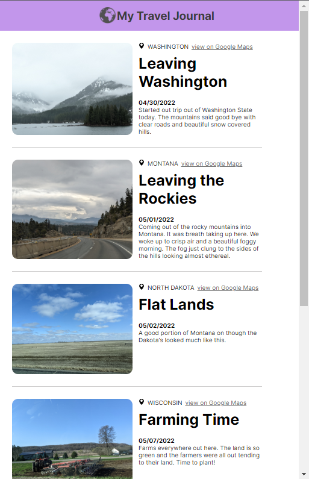

# Travel Journal
Site uses [Vite](https://vitejs.dev/) dev tool.
 
Im learning react from [Scrimba](https://scrimba.com/learn/learnreact).
  
This project is for using props with all training wheels taken off. We are tasked with making a travel journal that looks like the figma bellow but with our own travel information in it.  
  
Im trying to decide if I want to make it look exactly like theres or if I want to play with the css more. Though it might be the same so I can get on to more React concepts.
  
The goal here was to use react and CSS to recreate the template form [Figma](https://www.figma.com/file/QG4cOExkdbIbhSfWJhs2gs/Travel-Journal).
 
# My airbnb site
 
Here is how mine turned out.
 

 
I will update and post a live version later.